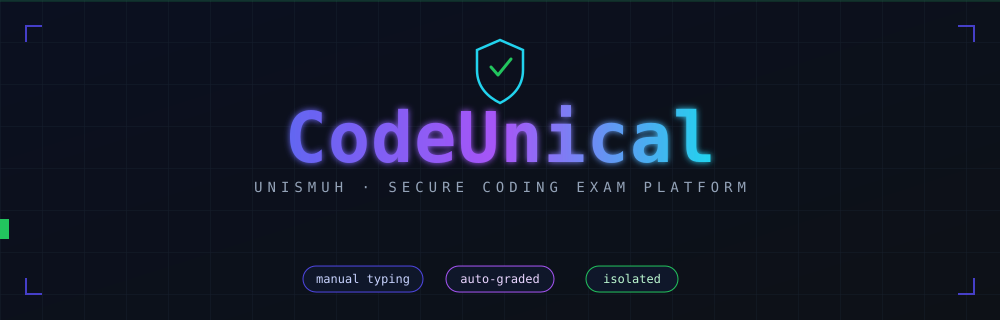
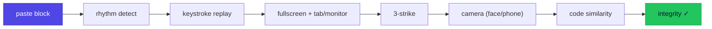
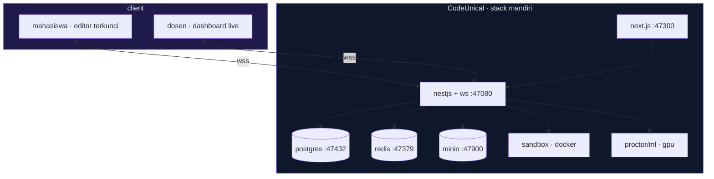

<div align="center">



<br/>

<code>status: in-development</code> &nbsp;·&nbsp; <code>mode: lab &amp; remote</code> &nbsp;·&nbsp; <code>license: MIT</code> &nbsp;·&nbsp; <code>UNISMUH · Informatika</code>

<br/>

<kbd>Ctrl</kbd> + <kbd>V</kbd> ❌ &nbsp;&nbsp; <kbd>Ctrl</kbd> + <kbd>C</kbd> ❌ &nbsp;&nbsp; <kbd>Manual&nbsp;Typing</kbd> ✅

</div>


## `~/` Apa itu CodeUnical?

**`CodeUnical`** = `Code` + `Uni` + `ICAL` — platform ujian & praktikum pemrograman berbasis web untuk kampus.

Mahasiswa **wajib mengetik kode secara manual** (tanpa copy-paste), kode **dijalankan langsung** di sandbox terisolasi, dinilai **otomatis** lewat *test case*, dan seluruh sesi **diawasi berlapis**.

> Multi-bahasa *pluggable* — `Python` · `SQL` · `C++` · `HTML` · … — tambah runner tanpa mengubah inti.


## `>` Fitur Unggulan

| | Fitur | Deskripsi |
|:--:|---|---|
| `⌨️` | **Manual Typing** | Blokir semua paste + deteksi ritme ketikan (anti-macro) |
| `🎬` | **Keystroke Replay** | Putar ulang cara kode diketik dari nol — bukti kepemilikan |
| `🖥️` | **Locked Fullscreen** | Deteksi keluar tab, split-screen, monitor kedua |
| `⚡` | **Live Execution** | Sandbox terisolasi, output instan |
| `🎯` | **Auto-Grade** | Uji lawan *hidden test case* + nilai parsial |
| `📷` | **Camera Proctor** | Deteksi wajah hilang / wajah asing / HP |
| `🔍` | **Code Similarity** | Bandingkan AST + *fingerprint*, bukan sekadar teks |
| `📊` | **Live Dashboard** | Pantau semua mahasiswa realtime + drill-down per individu |


## `#` Anti-Cheat Berlapis



> **Filosofi:** menang bukan di *memblokir input*, tapi di **kombinasi lapisan**. Walau cara memasukkan kode tak terdeteksi, **hasil identik tetap ketahuan** lewat cek kemiripan.


## `⌥` Mode Ujian

<table>
<tr>
<td width="50%" valign="top">

### `🏫` Lab
Berpengawas · HP dikumpulkan · dosen keliling

```diff
+ proctoring ringan
+ face-recognition penguji
+ paling andal (LAN langsung)
```

</td>
<td width="50%" valign="top">

### `🌐` Remote
Dari rumah · tanpa pengawas fisik

```diff
! kamera + face + HP wajib
! semua lapisan aktif
- butuh domain kampus
```

</td>
</tr>
</table>


## `⌘` Arsitektur




## `⚙` Tech Stack

<div align="center">

`Next.js` &nbsp; `NestJS` &nbsp; `TypeScript` &nbsp; `PostgreSQL` &nbsp; `Prisma`

`Redis` &nbsp; `MinIO` &nbsp; `Docker` &nbsp; `Python` &nbsp; `Prometheus`

</div>


## `⛁` Struktur

```text
CodeUnical/
├── web/          next.js — editor mahasiswa + dashboard dosen
├── api/          nestjs — rest + websocket + auth + orkestrasi
├── sandbox/      executor eksekusi kode (docker per bahasa)
├── proctor/      python — yolo · face recognition · code similarity
├── prisma/       skema & migrasi database
├── assets/       aset visual (banner.svg, rule.svg)
├── docs/         BLUEPRINT.md (cetak biru detail)
└── docker-compose.yml
```


## `☑` Roadmap

```text
[x] cetak biru & arsitektur
[x] MVP — editor + manual-typing + run + autosave + timer
[x] auto-grade + bank soal + randomisasi
[x] proctoring jendela + 3-strike + keystroke replay
[x] code similarity + dashboard dosen live
[x] proctoring kamera on-device (MediaPipe)
[x] multi-bahasa — 10 bahasa (py·js·ts·c·c++·java·go·php·ruby·rust), compile-once
[x] auth 3-peran + gate super-admin (login lokal)
[~] SSO UNISMUH — UI + alur siap, aktif saat kredensial dipasang
[ ] face recognition penguji + deteksi HP (YOLO) — fase GPU
[ ] MinIO bukti kamera · HTML/CSS live-preview · SQL
```


## `🔑` Konfigurasi SSO (opsional)

Login SSO **non-aktif** sampai variabel berikut diisi di `api/.env`, lalu restart backend —
tombol “Masuk dengan SSO UNISMUH” otomatis aktif:

```env
SSO_CLIENT_ID=...            # dari admin SSO UNISMUH
SSO_CLIENT_SECRET=...
SSO_AUTHORIZE_URL=https://<sso-host>/oauth/authorize
SSO_TOKEN_URL=https://<sso-host>/oauth/token
SSO_USERINFO_URL=https://<sso-host>/oauth/userinfo
SSO_REDIRECT_URI=https://<domain-api>/auth/sso/callback
# opsional — pemetaan peran dari klaim SSO:
SSO_ROLE_CLAIM=role          # nama klaim peran (default: role)
SSO_ROLE_DOSEN=dosen         # nilai klaim -> penguji
SSO_ROLE_MAHASISWA=mahasiswa # nilai klaim -> peserta
```

Peran otomatis: **dosen → penguji**, **mahasiswa → peserta**, lainnya → *pending* (menunggu super-admin).


## `!` Batasan Jujur

> CodeUnical membuat kecurangan **praktis sangat sulit**, bukan mustahil secara matematis.

- Blokir paste menahan mayoritas; *macro* bisa lolos → ditutup **ritme + replay + similarity**.
- Kamera = penekan kuat, bukan tembok → mode Lab **kumpulkan HP** fisik.
- 100% anti-nyontek hanya via **ujian lab terkontrol / proctoring**.


## `🔒` Keamanan & Privasi

- **Isolasi penuh** — docker/db/sandbox/port sendiri, tak menumpang proyek lain.
- **Data biometrik & rekaman** — persetujuan eksplisit, penyimpanan aman, retensi terbatas + auto-hapus.
- **Sandbox** — jaringan internal, batas cpu/ram/waktu, non-root, cap-drop.
- **Enforcement** nilai/strike di sisi server (client tak dipercaya).


<div align="center">

<sub><code>built for academic integrity</code></sub>

**Pengembang** — Muhammad Rizal Haris

<sub>© 2026 Muhammad Rizal Haris · Rilis di bawah <a href="LICENSE">MIT License</a></sub>

</div>
