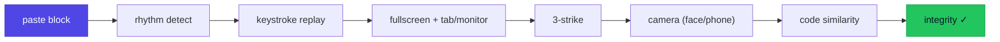
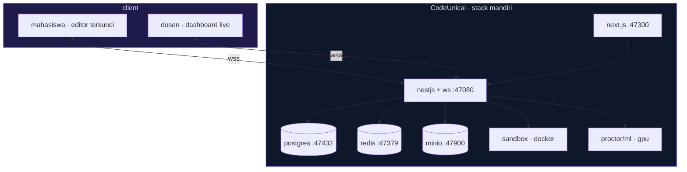
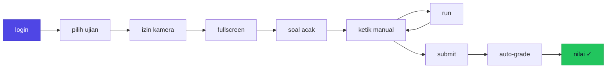

<div align="center">


<br/><br/>


</div>

---

<div align="center">

```console
$ codeunical exam:start --lang python --mode lab
  ✓ editor locked        ✓ paste blocked        ✓ camera armed
  ✓ fullscreen forced    ✓ keystrokes logged    ✓ similarity check
→ Ketik kodemu. Setiap ketukan direkam. Good luck.
```

<kbd>Ctrl</kbd> + <kbd>V</kbd> ❌ &nbsp;&nbsp; <kbd>Ctrl</kbd> + <kbd>C</kbd> ❌ &nbsp;&nbsp; <kbd>Manual&nbsp;Typing</kbd> ✅

</div>

---

## `~/` Apa itu CodeUnical?

**`CodeUnical`** = `Code` + `Uni` + `ICAL` — platform ujian & praktikum pemrograman berbasis web untuk kampus.

Mahasiswa **wajib mengetik kode secara manual** (tanpa copy-paste), kode **dijalankan langsung** di sandbox terisolasi, dinilai **otomatis** lewat *test case*, dan seluruh sesi **diawasi berlapis**.

> Multi-bahasa *pluggable* — `Python` · `SQL` · `C++` · `HTML` · … — tambah runner tanpa mengubah inti.

---

## `>` Fitur Unggulan

| | Fitur | Deskripsi |
|:--:|---|---|
| `⌨️` | **Manual Typing** | Blokir semua paste + deteksi ritme ketikan (anti-macro) |
| `🎬` | **Keystroke Replay** | Putar ulang cara kode diketik dari nol — bukti kepemilikan |
| `🖥️` | **Locked Fullscreen** | Deteksi keluar tab, split-screen, monitor kedua |
| `⚡` | **Live Execution** | Sandbox terisolasi, output instan |
| `🎯` | **Auto-Grade** | Uji lawan *hidden test case* + nilai parsial |
| `📷` | **Camera Proctor** | Deteksi wajah hilang / wajah asing / HP |
| `🔍` | **Code Similarity** | Bandingkan AST + *fingerprint*, bukan sekadar teks |
| `📊` | **Live Dashboard** | Pantau semua mahasiswa realtime + drill-down per individu |

---

## `#` Anti-Cheat Berlapis



> **Filosofi:** menang bukan di *memblokir input*, tapi di **kombinasi lapisan**. Walau cara memasukkan kode tak terdeteksi, **hasil identik tetap ketahuan** lewat cek kemiripan.

---

## `⌥` Mode Ujian

<table>
<tr>
<td width="50%" valign="top">

### `🏫` Lab
Berpengawas · HP dikumpulkan · dosen keliling

```diff
+ proctoring ringan
+ face-recognition penguji
+ paling andal (LAN langsung)
```

</td>
<td width="50%" valign="top">

### `🌐` Remote
Dari rumah · tanpa pengawas fisik

```diff
! kamera + face + HP wajib
! semua lapisan aktif
- butuh domain kampus
```

</td>
</tr>
</table>

---

## `⌘` Arsitektur



---

## `↻` Alur Ujian



---

## `⚙` Tech Stack

<div align="center">


</div>

---

## `⛁` Struktur

```text
CodeUnical/
├── web/          next.js — editor mahasiswa + dashboard dosen
├── api/          nestjs — rest + websocket + auth + orkestrasi
├── sandbox/      executor eksekusi kode (docker per bahasa)
├── proctor/      python — yolo · face recognition · code similarity
├── prisma/       skema & migrasi database
├── docs/         BLUEPRINT.md (cetak biru detail)
└── docker-compose.yml
```

---

## `☑` Roadmap

```text
[x] cetak biru & arsitektur
[ ] MVP — editor + manual-typing + run python + autosave + timer
[ ] auto-grade + bank soal + randomisasi
[ ] proctoring jendela + 3-strike + keystroke replay
[ ] code similarity + dashboard dosen live
[ ] camera + face recognition penguji
[ ] multi-bahasa (sql · c++ · html)
```

---

## `!` Batasan Jujur

> CodeUnical membuat kecurangan **praktis sangat sulit**, bukan mustahil secara matematis.

- Blokir paste menahan mayoritas; *macro* bisa lolos → ditutup **ritme + replay + similarity**.
- Kamera = penekan kuat, bukan tembok → mode Lab **kumpulkan HP** fisik.
- 100% anti-nyontek hanya via **ujian lab terkontrol / proctoring**.

---

## `🔒` Keamanan & Privasi

- **Isolasi penuh** — docker/db/sandbox/port sendiri, tak menumpang proyek lain.
- **Data biometrik & rekaman** — persetujuan eksplisit, penyimpanan aman, retensi terbatas + auto-hapus.
- **Sandbox** — jaringan internal, batas cpu/ram/waktu, non-root, cap-drop.
- **Enforcement** nilai/strike di sisi server (client tak dipercaya).

<br/>

<div align="center">

`built for academic integrity`

**Pengembang** — Muhammad Rizal Haris

<sub>© 2026 Muhammad Rizal Haris · Proprietary & Confidential</sub>


</div>
