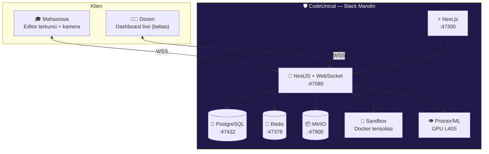
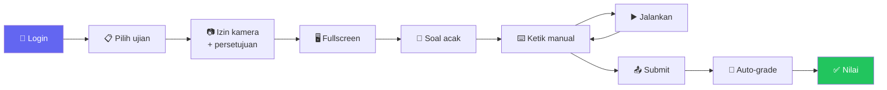

<div align="center">


<br/><br/>


<h3>🛡️ <em>Ketik sendiri, atau ketahuan.</em></h3>

</div>


## ✨ Apa itu CodeUnical?


**CodeUnical** ( **Code** + **Uni** + **ICAL** ) adalah platform ujian & praktikum pemrograman berbasis web untuk kampus.

Mahasiswa **wajib mengetik kode secara manual** (tanpa copy-paste), kode **dijalankan langsung** di server, dinilai **otomatis** lewat *test case*, dan seluruh sesi **diawasi berlapis** demi menjaga integritas akademik.

> Mendukung banyak bahasa (**Python · SQL · C++ · HTML · …**) secara *pluggable* — tinggal pasang runner bahasa baru tanpa mengubah inti.

<br clear="right"/>

## 🎯 Kenapa dibangun?

<table>
<tr>
<td width="50%">

**Masalah**
- 🕳️ Ujian koding mudah dicurangi (paste, buka tab, contek teman)
- ⏳ Dosen menghabiskan berjam-jam koreksi kode manual
- ❓ Tidak ada bukti kepemilikan ("ini beneran kamu yang ngetik?")
- 💸 Tool asing mahal & tak terintegrasi kampus

</td>
<td width="50%">

**Solusi CodeUnical**
- ⌨️ Ketik manual + anti-macro + replay ketikan
- 🤖 Penilaian otomatis via test case
- 🎥 Proctoring berlapis (jendela + kamera)
- 🏛️ Mandiri di server kampus, data tak ke cloud

</td>
</tr>
</table>

## 🚀 Fitur Unggulan

| | Fitur | Deskripsi |
|:--:|---|---|
| ⌨️ | **Ketik Manual** | Blokir semua paste (Ctrl+V, klik-kanan, drag) + deteksi ritme ketikan (anti-macro) |
| 🎬 | **Replay Ketikan** | Dosen memutar ulang cara kode diketik dari nol — bukti kepemilikan |
| 🖥️ | **Fullscreen Terkunci** | Deteksi keluar tab, split-screen, monitor kedua |
| ⚡ | **Eksekusi Real-time** | Kode dijalankan di sandbox terisolasi, output instan |
| 🎯 | **Auto-Grade** | Uji lawan test case tersembunyi + nilai parsial |
| 📷 | **Proctoring Kamera** | Deteksi wajah hilang / wajah asing / HP (event-based recording) |
| 🔍 | **Deteksi Kemiripan** | Bandingkan struktur kode (AST + fingerprint), bukan sekadar teks |
| 📊 | **Dashboard Live** | Dosen pantau semua mahasiswa realtime + drill-down per individu |

## 🛡️ Sistem Anti-Nyontek Berlapis

```mermaid
flowchart LR
    A["⌨️ Blokir Paste"] --> B["🎵 Deteksi Ritme"]
    B --> C["🎬 Replay Ketikan"]
    C --> D["🖥️ Fullscreen + Tab/Monitor"]
    D --> E["⚠️ Sistem 3-Strike"]
    E --> F["📷 Kamera (wajah/HP)"]
    F --> G["🔍 Kemiripan Kode"]
    G --> H["✅ Integritas Terjaga"]
    style H fill:#8B5CF6,color:#fff
    style A fill:#6366F1,color:#fff
```



> **Filosofi:** menang bukan di *memblokir input*, tapi di **kombinasi lapisan**. Walau cara memasukkan kode tak terdeteksi, **hasil identik tetap ketahuan** lewat cek kemiripan.

## 🎓 Mode Ujian

<table>
<tr>
<td width="50%" align="center">

### 🏫 Mode Lab
Berpengawas, HP dikumpulkan, dosen keliling

`Proctoring ringan` · `Face-recognition penguji` · `Paling andal (LAN langsung)`

</td>
<td width="50%" align="center">

### 🌐 Mode Remote
Dari rumah, tanpa pengawas fisik

`Kamera + Face + HP wajib` · `Semua lapisan aktif` · `Butuh domain kampus`

</td>
</tr>
</table>

## 🧩 Arsitektur



## 🔄 Alur Ujian



## 🛠️ Tech Stack

<div align="center">


</div>

## 📁 Struktur

```
CodeUnical/
├── README.md            ← dokumen ini
├── docker-compose.yml   ← stack mandiri (postgres · redis · minio · api · web · sandbox)
├── .env.example
├── web/                 ← Next.js (editor mahasiswa + dashboard dosen)
├── api/                 ← NestJS (REST + WebSocket + auth + orkestrasi)
├── sandbox/             ← executor eksekusi kode (Docker per bahasa)
├── proctor/             ← layanan Python (YOLO · face recognition · kemiripan kode)
├── prisma/              ← skema & migrasi database
└── docs/                ← dokumentasi tambahan
```

## 🗺️ Roadmap

- [x] 📐 Cetak biru & arsitektur
- [ ] 🧱 **MVP** — editor + ketik-manual + run Python + auto-save + timer
- [ ] 🎯 Auto-grade + bank soal + randomisasi
- [ ] 🛡️ Proctoring jendela + 3-strike + replay ketikan
- [ ] 🔍 Kemiripan kode + dashboard dosen live
- [ ] 📷 Kamera + face recognition penguji
- [ ] 🌐 Multi-bahasa (SQL · C++ · HTML)

## ⚖️ Batasan Jujur

> Agar ekspektasi lurus — CodeUnical membuat kecurangan **praktis sangat sulit**, bukan mustahil secara matematis.

- Blokir paste menahan mayoritas; macro yang "mengetik" bisa lolos → ditutup **deteksi ritme + replay + kemiripan kode**.
- Kamera = penekan kuat, bukan tembok → mode Lab **kumpulkan HP** secara fisik.
- 100% anti-nyontek hanya tercapai dengan **ujian lab terkontrol / proctoring**.

## 🔒 Keamanan & Privasi

- 🏛️ **Isolasi penuh** — Docker/DB/sandbox/port sendiri, tidak menumpang proyek lain.
- 🔐 **Data biometrik & rekaman** — persetujuan eksplisit, penyimpanan aman, **retensi terbatas + auto-hapus**.
- 🖥️ **Sandbox** — jaringan internal, batas CPU/RAM/waktu, non-root, cap-drop.
- ✅ Enforcement nilai/strike **di sisi server** (client tak dipercaya).


<div align="center">

**Dibuat dengan 🛡️ untuk integritas akademik — UNISMUH CodeUnical**

<em>© 2026 · Proprietary & Confidential</em>


</div>
