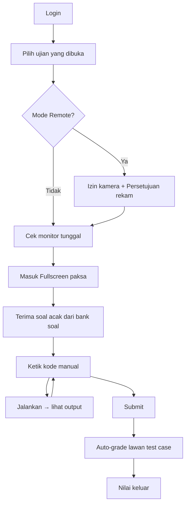
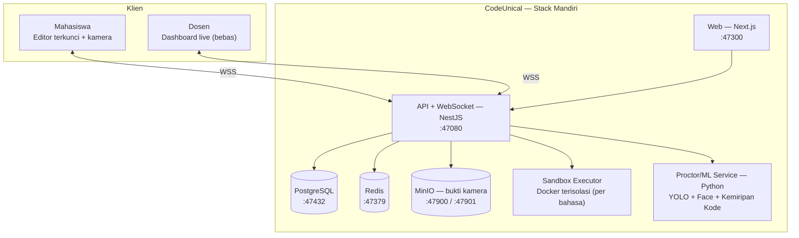

# 🛡️ UNISMUH CodeUnical

> **Platform Ujian Koding Anti-Nyontek** — ketik manual, multi-bahasa, bisa dijalankan, dengan pengawasan (proctoring) berlapis dan penilaian otomatis.

**CodeUnical** = **Code** (koding) + **Uni** (universitas) + **ICAL** (nama pembuat) — satu nama, tiga makna. Juga terbaca *unique*.

---

## 📑 Daftar Isi
1. [Ringkasan & Visi](#1-ringkasan--visi)
2. [Masalah yang Diselesaikan](#2-masalah-yang-diselesaikan)
3. [Peran Pengguna](#3-peran-pengguna)
4. [Mode Ujian](#4-mode-ujian)
5. [Fitur Lengkap](#5-fitur-lengkap)
6. [Alur Ujian Mahasiswa](#6-alur-ujian-mahasiswa)
7. [Sistem Anti-Nyontek (Berlapis)](#7-sistem-anti-nyontek-berlapis)
8. [Proctoring Kamera](#8-proctoring-kamera)
9. [Arsitektur (Stack Mandiri)](#9-arsitektur-stack-mandiri)
   - [Deployment, Tunnel & Monitoring (Keandalan)](#-deployment-tunnel--monitoring-keandalan)
10. [Tech Stack](#10-tech-stack)
11. [Struktur Folder](#11-struktur-folder)
12. [Model Data](#12-model-data)
13. [Keamanan & Privasi](#13-keamanan--privasi)
14. [Batasan Jujur](#14-batasan-jujur)
15. [Roadmap Pembangunan](#15-roadmap-pembangunan)
16. [Aturan Proyek](#16-aturan-proyek)

---

## 1. Ringkasan & Visi

CodeUnical adalah platform ujian & praktikum pemrograman berbasis web untuk lingkungan kampus. Mahasiswa **wajib mengetik kode secara manual** (tanpa copy-paste), kode **dijalankan langsung** di server, dinilai **otomatis** lewat test case, dan seluruh sesi **diawasi berlapis** untuk menjaga integritas akademik.

Mendukung **banyak bahasa** (Python, SQL, C++, HTML, dll.) secara *pluggable* — tinggal pasang runner bahasa baru tanpa mengubah inti.

**Prinsip desain:**
- **Ketik manual = paham, bukan tempel.** Blokir paste + deteksi ritme ketikan.
- **Berlapis, bukan satu tembok.** Tiap lapisan menutup celah lapisan lain.
- **Jujur soal batas.** Software = penekan kuat; kontrol fisik (kumpulkan HP, pengawasan lab) melengkapi.
- **Mandiri penuh.** Docker, database, dan sandbox milik sendiri — tidak menumpang proyek lain.

---

## 2. Masalah yang Diselesaikan

- Ujian koding konvensional mudah dicurangi (copy-paste, buka tab lain, contek teman).
- Dosen menghabiskan berjam-jam mengoreksi kode manual.
- Tidak ada bukti kepemilikan kode ("ini beneran kamu yang ngetik?").
- Tool asing (HackerRank, dll.) mahal, tidak terintegrasi kampus, dan tidak punya kontrol anti-nyontek sekuat ini.

---

## 3. Peran Pengguna

| Peran | Hak |
|---|---|
| **Mahasiswa** | Ikut ujian. Sesi **terkunci penuh** (anti-nyontek aktif). |
| **Dosen** | Buat soal, awasi live, lihat pelanggaran & replay, nilai. Sesi **bebas** (boleh copy-paste, banyak tab). |
| **Admin** | Kelola kelas, mata kuliah, enrol mahasiswa. |

> ⚠️ **Anti-cheat bersifat role-based.** Semua penguncian HANYA berlaku untuk sesi ujian mahasiswa. Dosen yang memonitor tidak dibatasi sama sekali.

---

## 4. Mode Ujian

Dosen memilih **mode per-ujian** saat membuat ujian:

| Mode | Konteks | Proctoring |
|---|---|---|
| **Lab (berpengawas)** | Di lab/kelas, HP dikumpulkan, dosen keliling | Ringan — fokus fullscreen, blokir paste, deteksi tab/monitor, kemiripan kode. Kamera opsional. **Face recognition penguji aktif** (dosen keliling tak terhitung pelanggaran). |
| **Remote (dari rumah)** | Tanpa pengawas fisik | Ketat — **kamera + face recognition + deteksi HP wajib**, semua lapisan software kritis. |

Satu platform, dua tingkat keketatan — dosen tinggal centang.

---

## 5. Fitur Lengkap

### Editor & Eksekusi
- Editor kode (Monaco) dengan syntax highlighting + nomor baris, **tanpa autocomplete yang menyuapi**.
- Multi-bahasa **pluggable**: Python, SQL, C++, HTML… (tiap bahasa = 1 runner).
- Kode **dijalankan di sandbox mandiri** (isolasi Docker, batas waktu & memori).
- Output & error ditampilkan jelas.
- **Catatan per bahasa:** Python/C++ jalan di sandbox; SQL butuh engine DB per sesi; HTML = live preview di browser (bukan eksekusi server).

### Anti-Nyontek Input
- **Blokir semua paste**: Ctrl+V, Ctrl+Shift+V, Shift+Insert, klik-kanan, middle-click, drag-drop.
- **Deteksi ritme ketikan** → menangkap macro/AutoHotkey (kecepatan & pola tak wajar).
- **⭐ Replay ketikan** → dosen memutar ulang cara kode diketik dari nol (bukti kepemilikan).
- **Log percobaan paste** (walau diblokir, dihitung sebagai sinyal).

### Proctoring Jendela
- **Fullscreen WAJIB** — keluar fullscreen = pelanggaran (mematikan split-screen satu layar).
- Deteksi **keluar tab / minimize / alt-tab**.
- Deteksi **window mengecil** (indikasi split-screen).
- **Deteksi >1 monitor saat mulai** → tolak/tandai (cabut monitor kedua dulu).
- **Sistem strike bertingkat**: peringatan (1) → potong nilai (2) → **ditendang + ulang (3)**.
- **Ulang dari awal**: soal diacak baru, tercatat & dilaporkan ke dosen, **timer TIDAK di-reset** (tetap jalan → rugi waktu).
- Semua **dicatat di server** + **heartbeat** (tak bisa diakali dengan mematikan JS).

### Proctoring Kamera *(lihat §8)*
- Deteksi **wajah hilang > 5 detik**.
- Deteksi **wajah asing** (bukan mahasiswa; penguji di-whitelist via face recognition).
- Deteksi **HP** (YOLO) — cadangan (utamanya HP dikumpulkan manual di mode Lab).
- **Rekaman berbasis kejadian** (bukan penuh) → klip + snapshot saat pelanggaran, simpan ke MinIO.
- **Persetujuan eksplisit wajib** sebelum mulai.

### Integritas Hasil
- **Cek kemiripan kode** antar-mahasiswa (struktur/AST + fingerprint MOSS, **bukan** cocok teks).
  - Identik/nyaris identik → **tolak** + "sama dengan Mahasiswa A" (A = submit lebih dulu).
  - Mirip sedang → **flag untuk dosen** (jangan auto-tolak; hindari salah tuduh di soal sederhana).
- **Matriks kemiripan** visual (peta siapa mirip siapa).
- (Opsional) tanda **kode buatan AI**.
- **Larang sesi ganda** (1 akun = 1 device).

### Penilaian Otomatis
- Jalankan kode lawan **test case tersembunyi** → nilai otomatis.
- **Nilai parsial** per test case yang lolos.

### Dashboard Dosen (Live)
- **Tampilan keseluruhan**: grid semua mahasiswa (status, progres, pelanggaran realtime, preview kode ringkas) — "dinding CCTV" ujian.
- **Tampilan per-mahasiswa**: drill-down live — kode yang sedang diketik, output, pelanggaran, kamera (mode remote), timer, replay ketikan.
- Bank soal + kategori kesulitan + **randomisasi soal** per mahasiswa.
- **Jadwal ujian** (buka/tutup otomatis).
- Laporan pelanggaran + **ekspor nilai (Excel/CSV)**.

### Pengalaman Mahasiswa
- **Auto-save berkala** (listrik mati/browser crash ≠ kode hilang).
- **Timer + auto-submit** saat waktu habis.
- Output/error jelas, countdown terlihat.

---

## 6. Alur Ujian Mahasiswa



---

## 7. Sistem Anti-Nyontek (Berlapis)

| Lapisan | Menangkap | Kekuatan |
|---|---|---|
| Blokir paste | Nyontek casual (Ctrl+V, klik-kanan, dll.) | Andal |
| Deteksi ritme ketikan | Macro/AutoHotkey | Kuat |
| Replay ketikan | Bukti kepemilikan (dilihat dosen) | Kuat |
| Fullscreen wajib | Split-screen satu layar | Andal |
| Deteksi tab/blur/monitor | Pindah aplikasi, monitor kedua | Kuat |
| Sistem 3-strike | Efek jera + diskualifikasi | Kuat |
| Kamera (wajah/HP) | Orang lain / perangkat kedua | Sedang–Kuat |
| **Cek kemiripan kode** | **Hasil identik, apa pun cara masuknya** | **Kuat (jaring terakhir)** |
| Kumpulkan HP (fisik) | Contekan di HP | Andal (mode Lab) |

**Filosofi:** menang bukan di "memblokir input", tapi di **kombinasi**. Walau cara memasukkan kode tak terdeteksi, **hasil identik tetap ketahuan** lewat cek kemiripan.

---

## 8. Proctoring Kamera

### Aturan Deteksi
- **Normal** = 1 wajah (mahasiswa) → aman.
- **Wajah ke-2 muncul** → cek: apakah **wajah penguji terdaftar**?
  - Ya (penguji) → **aman** (di-whitelist).
  - Tidak dikenal → **pelanggaran + rekam klip**.
- **Wajah hilang > 5 detik** → pelanggaran + rekam klip.
- **HP terdeteksi** (YOLO) → pelanggaran + rekam (cadangan).

> "Nunduk lihat HP" **tidak** dipakai sebagai pemicu — di ujian ketik, mahasiswa wajar menunduk melihat keyboard. Andalannya: wajah hilang / wajah asing / HP.

### Face Recognition Penguji
Karena dosen keliling & menunduk melihat layar mahasiswa, penguji **mendaftarkan wajahnya lebih dulu**. Saat wajah ke-2 muncul, sistem mencocokkan ke daftar penguji → jika cocok, bukan pelanggaran. (Butuh model pengenalan wajah, mis. InsightFace/ArcFace — fase akhir.)

### Rekaman
- **Bukan rekaman penuh.** Hanya **klip pendek + snapshot** saat ada kejadian → hemat storage/bandwidth.
- Pemrosesan wajah di sisi browser; rekaman hanya saat pelanggaran.

### Persetujuan & Retensi
- Layar **persetujuan eksplisit** sebelum mulai: *"Ujian ini merekam kamera saat terdeteksi pelanggaran."*
- Penyimpanan aman (MinIO), akses terbatas dosen, **auto-hapus** setelah masa retensi.

---

## 9. Arsitektur (Stack Mandiri)

> **Prinsip isolasi:** CodeUnical berdiri sendiri — **tidak** menumpang Docker/DB/sandbox layanan lain di server yang sama. Namespace, jaringan, volume, dan port sendiri.



### Alokasi Port (blok 47xxx — bebas, tidak bentrok)
| Layanan | Port |
|---|---|
| Web (frontend) | **47300** |
| API + WebSocket | **47080** |
| PostgreSQL | **47432** |
| Redis | **47379** |
| MinIO (API / Console) | **47900 / 47901** |

> Blok 47xxx dipilih agar tidak bentrok dengan layanan lain yang berjalan di server yang sama.

---

## 🚀 Deployment, Tunnel & Monitoring (Keandalan)

### Strategi bertahap

| Fase | Frontend | Backend & Data | Akses | Catatan |
|---|---|---|---|---|
| **Sekarang (dev)** | localhost | localhost / LAN kampus | `localhost` + IP kampus | Semua jalan penuh, paling andal |
| **Preview** | Vercel | Kampus via Cloudflare Tunnel | URL Vercel | UI langsung jalan; fitur backend hidup bila tunnel nyala |
| **Produksi ujian** | Server kampus (same-origin) | Server kampus | Domain kampus / LAN | Paling andal; data tidak ke cloud |

### Aturan penting
- **Ujian Lab** → mahasiswa di LAN kampus menembak server langsung (mis. `<IP-SERVER-LAB>:47300`) — tanpa internet/tunnel/Vercel = paling cepat & andal.
- **Ujian Remote** → butuh **domain kampus** (endgame), bukan tunnel.
- **Vercel = preview/demo saja.** Ujian sungguhan + data kamera **tidak** lewat Vercel.
- **URL API fleksibel per-environment** (`NEXT_PUBLIC_API_URL`): localhost → `:47080`; Vercel → URL tunnel; domain kampus → same-origin. (Pelajaran dari proyek sebelumnya: jangan hardcode base URL.)

### Tunnel
- **Cloudflare Tunnel** (named), **BUKAN** ngrok free (kuota ~1GB/bln + interstitial = tak layak untuk ujian).
- Endgame: **nginx reverse-proxy kampus + HTTPS** di domain (pola `exam.kampus.ac.id`).

### Monitoring
- **Prometheus + Grafana + Alertmanager → Telegram** (memakai pola bot Telegram yang sudah ada).
- **Exporter**: node-exporter (CPU/RAM/disk), **DCGM/nvidia** (GPU), metrik app NestJS (latensi API, koneksi WebSocket, sesi ujian aktif, durasi eksekusi sandbox, kedalaman antrean, pool DB).
- **UptimeRobot** (pemantau luar) + endpoint `/health` (pemantau internal mati total tetap ada yang lapor).

### Rekayasa Keandalan
- **Auto-save + resume sesi** → putus koneksi ≠ kehilangan kerja.
- **Heartbeat** → deteksi putus, sambung mulus saat kembali.
- **Degradasi anggun** → jika service proctor/ML mati, **ujian tetap jalan** (pelanggaran di-antre, jangan blokir ujian).
- **Pool DB benar** → `idle_in_transaction_timeout`, `pool_size`, hindari eager-load (pelajaran dari insiden produksi sebelumnya) agar tahan 40 mahasiswa submit bersamaan.
- **Antrean penilaian** (BullMQ/Redis) → eksekusi berat tidak menyumbat API.
- **Backup otomatis terenkripsi** (pola rclone → Google Drive).
- **Auto-restart** (Docker `restart: unless-stopped` + systemd) → tahan reboot/crash.
- **Rate limiting** + graceful shutdown.

---

## 10. Tech Stack

| Lapisan | Teknologi |
|---|---|
| Frontend | Next.js + Monaco Editor + Tailwind CSS |
| Backend | NestJS (TypeScript) — REST + WebSocket Gateway |
| Database | PostgreSQL + Prisma |
| Cache/State | Redis (sesi ujian, antrean penilaian, heartbeat) |
| Sandbox | Docker terisolasi, image per bahasa (Python, C++, …), batas CPU/RAM/waktu, jaringan internal |
| Storage | MinIO (klip & snapshot bukti kamera) |
| ML/Proctor | Python — YOLO (deteksi HP), InsightFace/ArcFace (face recognition), AST + winnowing (kemiripan kode) |
| Realtime | WebSocket / Socket.IO (stream ketikan, monitoring live, heartbeat) |
| Monitoring | Prometheus + Grafana + Alertmanager→Telegram; node/DCGM(GPU) exporter; UptimeRobot |
| Orkestrasi | Docker Compose (stack mandiri) |

---

## 11. Struktur Folder

```
CodeUnical/
├── README-CODEUNICAL.MD        # dokumen ini
├── docker-compose.yml          # stack mandiri: postgres, redis, minio, api, web, sandbox, proctor
├── .env.example
├── web/                        # Next.js — editor mahasiswa + dashboard dosen
├── api/                        # NestJS — REST + WebSocket + auth + orkestrasi
├── sandbox/                    # executor eksekusi kode (Docker terisolasi)
│   ├── python/                 # image + runner Python
│   ├── cpp/                    # image + runner C++
│   └── sql/                    # engine SQL per sesi
├── proctor/                    # layanan Python: YOLO + face recognition + kemiripan kode
├── prisma/                     # skema & migrasi database
└── docs/                       # dokumentasi tambahan
```

---

## 12. Model Data

Entitas inti (sketsa):

- **User** — id, nama, email, role (mahasiswa/dosen/admin), face_embedding (penguji/mahasiswa, mode remote).
- **Course / Kelas** — mata kuliah + daftar peserta.
- **Exam** — judul, mode (lab/remote), jadwal buka/tutup, durasi, konfigurasi anti-cheat (toleransi strike, potongan nilai, dll.).
- **Problem** — soal, bahasa, deskripsi, test case tersembunyi, tingkat kesulitan.
- **ExamSession** — sesi 1 mahasiswa 1 ujian: status, waktu mulai, strike count, timer.
- **Submission** — kode, hasil test case, nilai, timestamp.
- **KeystrokeLog** — aliran ketikan (untuk replay & analisis ritme).
- **ViolationLog** — jenis pelanggaran, waktu, durasi, bukti (link klip/snapshot).
- **ProctorFrame** — snapshot/klip kamera saat kejadian (di MinIO).
- **SimilarityMatch** — pasangan submission mirip + skor.

---

## 13. Keamanan & Privasi

- **Isolasi penuh** dari proyek lain (Docker/DB/sandbox/port sendiri).
- **Sandbox eksekusi**: jaringan internal, batas CPU/RAM/waktu, non-root, cap-drop, cegah akses keluar.
- **Data biometrik** (face embedding): kategori paling sensitif — persetujuan tegas, penyimpanan aman, akses terbatas, **retensi terbatas + auto-hapus**, idealnya restu prodi/kampus.
- **Rekaman kamera** hanya berbasis kejadian, terenkripsi, akses dosen berwenang.
- Enforcement nilai/strike **di sisi server** (client tak dipercaya).
- Auth: login sendiri dulu; **SSO Keycloak kampus opsional** menyusul.

---

## 14. Batasan Jujur

Agar ekspektasi lurus:

- **Blokir paste** menahan mayoritas, TAPI macro yang "mengetik" karakter bisa lolos → ditutup **deteksi ritme + replay + kemiripan kode**.
- **Kamera** = penekan kuat, **bukan** tembok (HP bisa di bawah meja) → di mode Lab, **kumpulkan HP** secara fisik.
- **"Wajah/monitor/tab"** bisa dideteksi, tapi **perangkat terpisah** (HP/tablet berisi contekan) tak terlihat software → jaring terakhir = kamera + pengawasan.
- **100% anti-nyontek** hanya tercapai dengan **ujian lab terkontrol / proctoring**. CodeUnical membuatnya **praktis sangat sulit**, bukan mustahil secara matematis.
- **Kemiripan kode** bisa salah tuduh pada **soal sederhana** (satu-satunya cara natural menulis) → auto-tolak hanya untuk **identik**; sisanya flag dosen.

---

## 15. Roadmap Pembangunan

Dibangun **bertahap** agar tidak berantakan:

| Tahap | Isi | Status |
|---|---|---|
| **1. MVP** | Struktur mandiri + Docker/DB + editor + **ketik-manual** + jalankan Python + auto-save + timer | ⏳ berikutnya |
| **2. Penilaian** | Auto-grade test case + bank soal + randomisasi | — |
| **3. Proctoring jendela** | Fullscreen wajib + deteksi tab/monitor + 3-strike + replay ketikan | — |
| **4. Integritas & Dosen** | Cek kemiripan kode + dashboard live dosen | — |
| **5. Kamera** | Deteksi wajah/HP + **face recognition penguji** | — |
| **6. Multi-bahasa** | Tambah SQL, C++, HTML | — |

---

## 16. Aturan Proyek

- **Mandiri penuh** — TIDAK menumpang sumber daya layanan lain di server. Docker, DB, sandbox, port sendiri.
- **Isolasi Docker** — namespace/prefix `codeunical-*`, jaringan & volume sendiri; jangan `prune` global.
- **Bahasa komunikasi**: Indonesia.
- **Nama**: CodeUnical (tampil "UNISMUH CodeUnical" di UI).

---

*Dokumen ini adalah cetak biru (blueprint) master. Diperbarui seiring pembangunan tiap tahap.*
